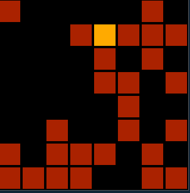

# pewpew-lightsout-pygbag

- [pewpew-lightsout-pygbag](#pewpew-lightsout-pygbag)
  - [Usage of Python WebAssembly for everyone (packager + test server)](#usage-of-python-webassembly-for-everyone-packager--test-server)
    - [Test and debug the game in browser](#test-and-debug-the-game-in-browser)
    - [Publish game on itch.io](#publish-game-on-itchio)
  - [Play in pewmulator](#play-in-pewmulator)
    - [Logging in pewmulator](#logging-in-pewmulator)



Very simple implementation of the [Lights Out
game](https://en.wikipedia.org/wiki/Lights_Out_(game)) for [PewPew
10.2](https://pewpew.readthedocs.io/en/latest/pewpew10/overview.html) in
Python.

The goal of the puzzle is to switch all the lights off, preferably in as few
button presses (use button `X`) as possible.

This is a attempt to run the pewpwew game and the pewmulator (pygame emulator)
in the browser with [pygbag](https://github.com/pygame-web/pygbag).

The original game can be found here:
<https://github.com/BjoernSchilberg/pewpew-lightsout>

This repo contains minimal adjustments so that the game can run in browser.

## Usage of Python WebAssembly for everyone (packager + test server)

Runs python code directly in modern web browsers, including mobile versions.

The python app must contain a `main.py` and its loop must be async aware!

```shell
cd pewpew-lightsout-pygbag
pip3 install pygbag --user --upgrade
pygbag .
```

### Test and debug the game in browser

Open: <http://localhost:8000#debug>

### Publish game on itch.io

Create a package for itch.io

```shell
pygbag --archive .
```

Upload `web.zip` from the `/build` directory.

## Play in pewmulator

[pewmulator](https://github.com/pewpew-game/pew-pygame) is an emulator for
running PewPew games on desktop computers.


```shell
python3 mai.py
```

### Logging in pewmulator

```python
import logging
logging.basicConfig(format='%(asctime)s - %(message)s', level=logging.DEBUG)
```

```python
logging.debug("x: %s",x)
logging.debug("y: %s",y)
```
